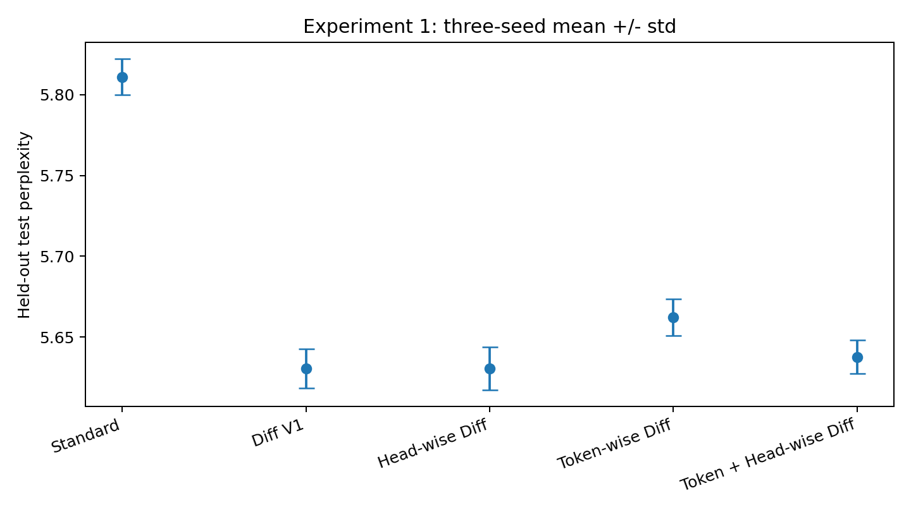
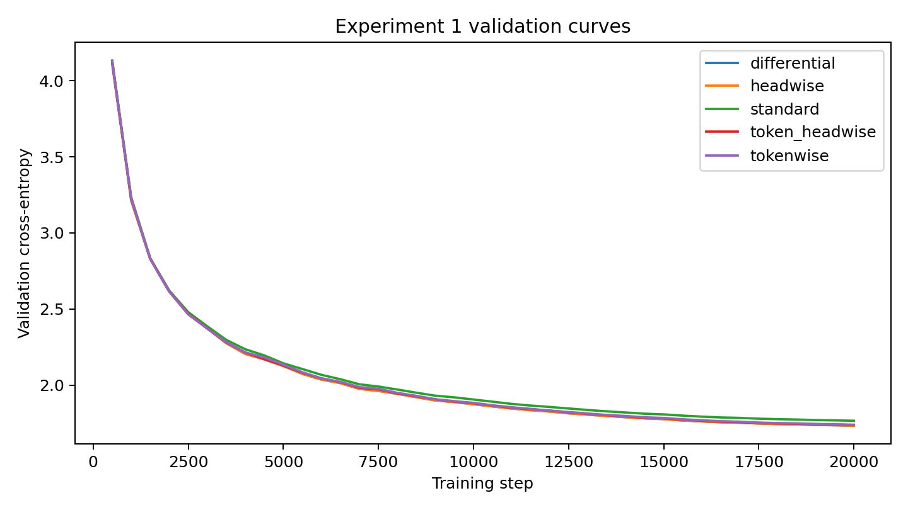
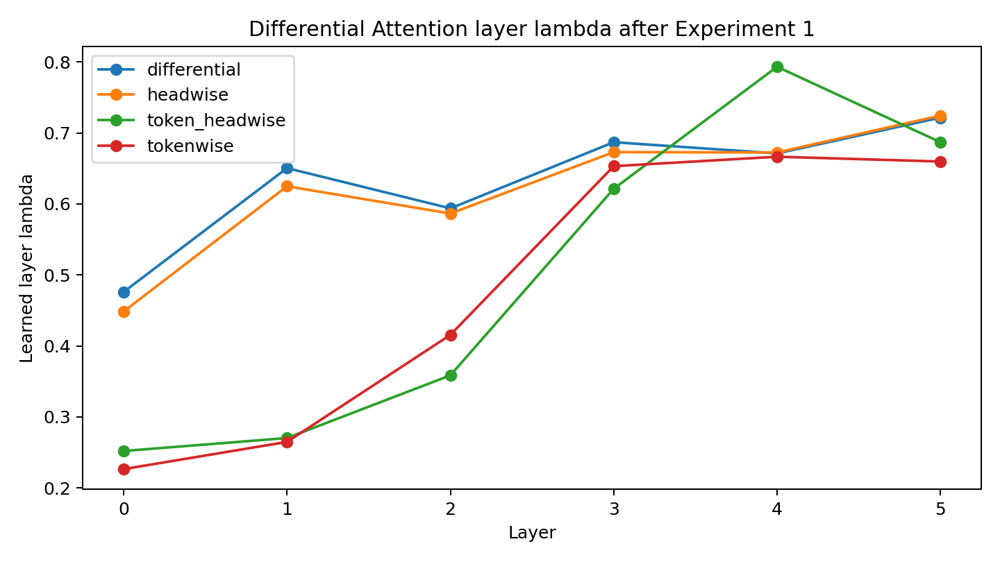
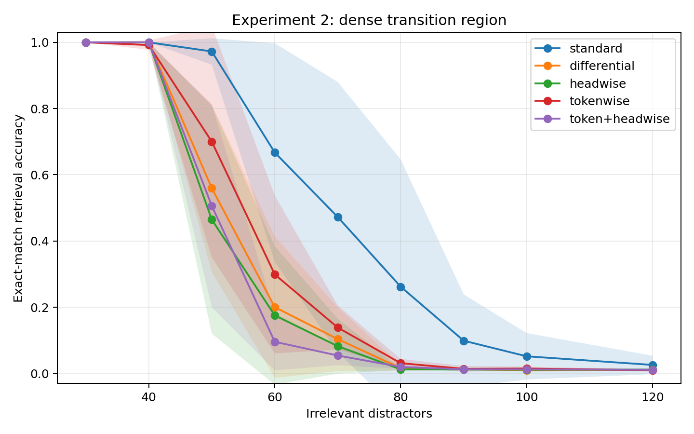

# Adaptive Differential Attention

This project studies how the granularity of the differential coefficient affects [Differential Transformer](https://proceedings.iclr.cc/paper_files/paper/2025/hash/00b67df24009747e8bbed4c2c6f9c825-Abstract-Conference.html) (Ye et al., ICLR 2025).

Standard self-attention computes an attention map from queries and keys:

$$
A = \mathrm{softmax}\left(\frac{QK^T}{\sqrt{d}}\right)
$$

Differential Attention instead computes two attention maps and subtracts the second from the first:

$$
A_{\mathrm{diff}} = A_1 - \lambda A_2
$$

The coefficient $\lambda$ controls the strength of the subtraction. We study four Differential Attention variants that differ only in the granularity of $\lambda$.

### Differential Attention

One coefficient per layer:

$$
A_{\mathrm{diff}}^{(l)} = A_1^{(l)} - \lambda_l A_2^{(l)}
$$

### Head-wise Differential Attention

One coefficient per attention head:

$$
A_{\mathrm{diff}}^{(l,h)} = A_1^{(l,h)} - \lambda_{l,h} A_2^{(l,h)}
$$

### Token-wise Differential Attention

One token-dependent coefficient shared across heads:

$$
A_{\mathrm{diff}}^{(l,t)} = A_1^{(l,t)} - \lambda_{l,t} A_2^{(l,t)}
$$

### Token + Head-wise Differential Attention

One coefficient per token and attention head:

$$
A_{\mathrm{diff}}^{(l,h,t)} = A_1^{(l,h,t)} - \lambda_{l,h,t} A_2^{(l,h,t)}
$$

All adaptive variants are initialized to match the original Differential Attention behavior. The remaining Transformer architecture is kept unchanged for a controlled comparison.

## Experiment 1: TinyStories Language Modeling

We compare Standard Attention and the four Differential Attention variants on TinyStories under the same training setup.

All models use a 6-layer decoder-only Transformer with `d_model=256`, 8 attention heads, `ffn_dim=704`, context length 128, and an 8,192-token BPE tokenizer. Models are trained for 20,000 steps using the same optimizer and learning-rate schedule.

Results are reported as mean ± sample standard deviation across three seeds.

| Variant | Best Validation Loss | Test Loss | Test PPL |
|---|---:|---:|---:|
| Standard Attention | 1.7643 ± 0.0019 | 1.7598 ± 0.0019 | 5.8110 ± 0.0111 |
| Differential Attention | 1.7331 ± 0.0010 | 1.7282 ± 0.0021 | 5.6304 ± 0.0121 |
| Head-wise Differential Attention | 1.7330 ± 0.0012 | 1.7282 ± 0.0023 | 5.6305 ± 0.0132 |
| Token-wise Differential Attention | 1.7391 ± 0.0018 | 1.7338 ± 0.0020 | 5.6622 ± 0.0112 |
| Token + Head-wise Differential Attention | 1.7342 ± 0.0033 | 1.7295 ± 0.0018 | 5.6376 ± 0.0104 |

Across three seeds, all Differential Attention variants improve test perplexity over Standard Attention.

The original layer-wise Differential Attention and Head-wise Differential Attention perform almost identically. 
Increasing the granularity of $\lambda$ therefore does not provide a clear additional language-modeling benefit in this setting. 
The token-conditioned variants also do not outperform the original formulation.

## Experiment 2: OOD Context-Length Retrieval Robustness

We test the five attention variants on a synthetic needle-in-a-haystack retrieval task. Each model is fine-tuned from its Experiment 1 checkpoint using contexts with 4–30 distractors, and then tested on longer contexts with up to 480 distractors.

Since adding more distractors also makes the input longer, this experiment mainly tests OOD context-length retrieval robustness, rather than pure resistance to irrelevant information.

| Variant | 30 | 60 | 120 | 240 | 480 |
|---|---:|---:|---:|---:|---:|
| Standard | 1.000 ± 0.000 | 0.667 ± 0.330 | 0.026 ± 0.028 | 0.008 ± 0.003 | 0.009 ± 0.002 |
| Differential | 1.000 ± 0.000 | 0.200 ± 0.214 | 0.011 ± 0.001 | 0.008 ± 0.002 | 0.007 ± 0.003 |
| Head-wise | 1.000 ± 0.000 | 0.175 ± 0.209 | 0.012 ± 0.001 | 0.008 ± 0.002 | 0.006 ± 0.002 |
| Token-wise | 1.000 ± 0.000 | 0.299 ± 0.238 | 0.010 ± 0.002 | 0.009 ± 0.004 | 0.006 ± 0.003 |
| Token + Head-wise | 1.000 ± 0.000 | 0.096 ± 0.086 | 0.011 ± 0.004 | 0.008 ± 0.002 | 0.006 ± 0.001 |

In this small-scale setting, Standard Attention handles longer contexts better, while the Differential variants start to lose accuracy earlier. Making $\lambda$ more fine-grained does not seem to improve robustness.

